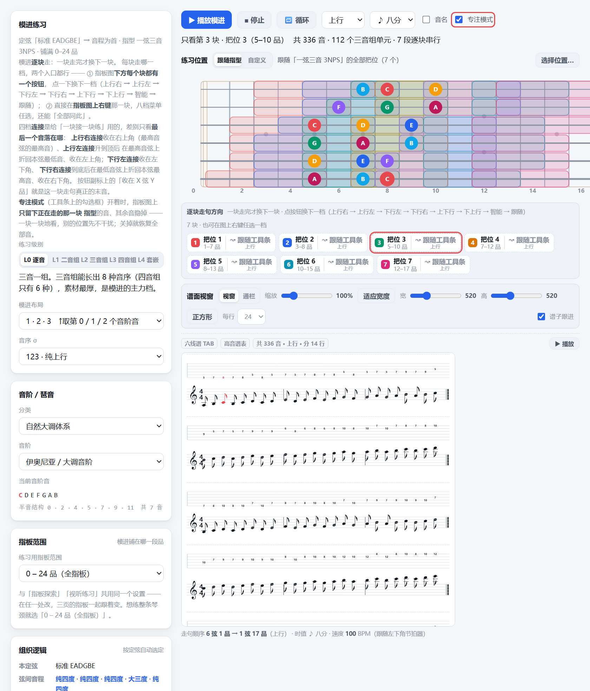

# Fretboard Trainer · 吉他指板训练器

> **A single-file, zero-dependency fretboard practice tool you can open offline by double-clicking.**
> Scale systems, fingering patterns, CAGED, arpeggios, chord progressions, voice leading and
> improvisation material — all inside one HTML file.

Try it online: https://99gugugu.github.io/Guitar-Bass-Fretboard-Trainer/


*The UI is in Simplified Chinese. This page is a summary for English readers.*

---

## Quick start

No Node, no build step, no network, no install.

| Way | Steps |
|---|---|
| **Local** (recommended) | Download `index.html` and double-click it. Works offline. |
| **Online** | Open the link at the top of this page — nothing to install. |
| **Clone** | `git clone <this repo>` and open `index.html`. |

Everything is embedded in the file — the page issues **no network requests at all**.
Preferences (key, tuning, theme) go to `localStorage` and never leave your machine.

## The fourteen tabs

| Tab | What it does |
|---|---|
| 🎯 **Fretboard Explorer** | Pick scale / key / tuning and highlight it on the neck. Switch between 9 fingering systems, split by position, overlay colour blocks, highlight the scale's characteristic chord arpeggio. Every fretboard diagram carries **TAB + staff** underneath, playable and loopable |
| 🎵 **Fretboard Practice** | Modular sequence practice: pick a scale → pick **specific position blocks** (multi-select, even across fingering systems, re-orderable) → give each block one of **8 walk modes**. Blocks are walked one at a time, with fretboard and score highlighting in sync. The score sits in a **viewport of its own**: notes per row adjustable (21–24), viewport width/height and score zoom on sliders, and playback follows the current note |
| 🎧 **Ear & Sight Practice** | Seven drills: find-the-note, scale fill-in, note name by ear, interval by ear, mode by ear, **staff sight reading** and **numbered-notation (jianpu) sight reading** — same "read it, then tap it in order on the neck", once from a staff with key signature and rhythm (the staff follows the tuning), once from movable-do numbers (6 system entries × 7 sub-scales each = 42) |
| 📚 **Scale Library** | 82 scales / arpeggios in 9 families, each with interval structure, degrees, characteristic chords and usage notes |
| 🧩 **CAGED Chords** | The five positions of a chord on the neck, ordered by **actual lowest fret** so the first shape changes with the key. Ships a **capo**: with the capo on fret N the shapes are those of "root minus N semitones", fret numbers are written relative to the capo, and each card also states the frets you actually play |
| 🧮 **Scale & Harmony** | Seven degrees × five chord-tone extension layers; click any cell to jump to its shape |
| 🎼 **Arpeggio Explorer** | One arpeggio across the five CAGED positions, plus which scales it usually pairs with |
| 🔗 **Progression Trainer** | 456 chord progressions with note-by-note voice leading and recommended fingerings |
| 🎸 **Jam** | 200 backing tracks. The progression is laid out bar by bar, then the **minimum-hand-travel** voicings, then the improvisation material available over each chord |
| 🔍 **Improvisation Lookup** | Given a chord quality and key, list usable scales, arpeggios and substitutions |
| 🎹 **Voicing** | Two modes: **best voice leading** treats the whole progression as one object and searches for the lowest total hand travel (returning several distinct optima); **most common / easiest** picks each chord independently by textbook criteria (first position first, no gap inside the string group, fewest fingers…) — the equivalent of reading a chord chart, and besides the "most common" fingering it offers one scheme per low / mid / high register so the same chord can be compared across positions. A **capo** is available in both modes: set it to fret N and the whole progression is recomputed |
| 🖐 **2-1-2 Arpeggios** | Arpeggio shapes built on a `2-1-2` notes-per-string alternation, starting from the 6th / 5th / 4th / 3rd string |
| 🎯 **Chord Lookup** | The other direction: tap notes on the neck (3 or more) to **name the chord**; tap exactly two notes and it names their **interval** and checks whether they form a power chord (`X5`). Coarse / degree-aware / diatonic modes; a non-root bass becomes a slash chord; when nothing fits, it falls back to the five trichord families (root removed, six notes split into two groups of three) |
| 🎼 **Scale Lookup** | Tap notes on the neck (5 or more) to **find the scale**. All 82 scales × 12 tonics = 984 readings, layered by "how many notes you are still missing". Every reading of the same pitch-class set is listed side by side — which is why a seven-note scale can only ever be pinned down to its **parent-scale group** |

## Read the staff, find it on the neck: staff sight reading

The **sixth drill** in Practice. The prompt is not text but a real **staff excerpt**: key signature and
rhythm included — note values, stems, flags, dots, rests and a final barline are all notated properly.
Read it, then tap the matching notes **in order** on the neck.

| Sight reading · guitar (treble staff) | Sight reading · 4-string bass (bass staff) |
|---|---|
|  |  |

- **The staff follows the tuning.** Guitar (including all open tunings) → **treble staff**;
  4-string EADG / 5-string BEADG bass → **bass staff** (F clef). No switch to flip: changing tuning
  within the same family keeps the current question, **crossing families deals a new one**.
- **Notated per instrument convention.** Guitar sounds an octave below the written pitch; bass is
  written an octave up in the same spirit (low E sounds E1, written on the ledger line below the bass
  staff). The note-name hint shows the **written** names.
- **The question is always playable.** Notes are chosen only from scale tones inside the currently
  tappable range. For bass the range is clipped to **at most three ledger lines**
  (roughly sounding A0–G3) — running the full 24 frets would drag out seven or eight ledger lines.
- **Tap once, every position of that pitch lights up** (ring colour per pitch class, the same 12-colour
  set as the chord lookup), so you see every place that note lives on the neck.
- **Judging is octave-exact.** The written pitch is what you must tap: the same pitch in another
  position counts (open 1st string and 5th fret 2nd string are both E4), another octave does not.
  All correct → next question and a point; any wrong → those notes get a red cross, minus 6, and you
  stay on the question to undo and resubmit.
- **Reading aids**: **▶ play the prompt** (sounds the written pitches in order; rests take time but stay
  silent) and **☐ show note names** (off by default) under the staff.
- A live answer row records what you tapped, with **↶ undo** and **clear**; note count per question is
  yours to pick (3–12, default 5).

## Read the numbers, find it on the neck: jianpu (numbered notation) sight reading

The **seventh drill** in Practice, and the same exercise read a different way. The prompt is drawn as
**jianpu** — movable-do numbers with octave dots, accidentals, duration marks (an underline for
eighths, a dot for dotted quarters, dashes for half and whole notes) and bar lines. The rhythm comes
from **exactly the same question generator** as staff sight reading. Read it, then tap the notes in
order on the neck.

- **The score states `1 = X` in the top-left corner** — in movable-do notation, *where 1 sits* is the
  whole point; without it the page is unreadable. Two of the three minor systems are written with
  **the relative major's tonic as 1** (hence `6712345`), while **melodic minor keeps both spellings
  and therefore occupies two rows**: `12b34567` (1 = la, its own tonic — you can see at a glance
  that the ascending 6th and 7th are restored) and `67123#4#5` (1 = do, the relative major's tonic —
  the only spelling that shows the "major with a flat 3rd" shape).
- **6 system entries × 7 sub-scales = 42**, every sub-scale spelled in movable do: rotating the
  parent scale's base string left by one degree gives the next mode. Natural major `1234567` →
  Dorian `2345671` → Phrygian `3456712` → Lydian `4567123` → Mixolydian `5671234` → natural minor
  `6712345` → Locrian `7123456`; likewise harmonic minor `671234#5`, harmonic major `12345b67`
  and double harmonic minor `671#234#5`. Melodic minor appears twice — once per spelling
  (`12b34567`… under 1 = la, `67123#4#5`… under 1 = do).
- **Two-level selection**: the system row only means select-all / select-none; the real question pool
  is the **sub-scale level** (a system row shows as **indeterminate** when only part of it is ticked).
  Clearing everything falls back to all six system entries selected (42 entries).
- Note count per question is 3–12 (default 5).
- Everything else matches staff sight reading: **every spot with that pitch lights up**, **octave is
  judged strictly**, **▶ play the prompt / ☐ show note names** (off by default), **↶ undo / ✅ submit**,
  and a correct answer advances automatically.
  Note names here are the **sounding** names — jianpu has no written-octave convention. The **answer
  chips** use those same sounding names, so a chip, the octave dots on the score and the note names
  under it all sit in **one octave**. (The staff-reading chips follow the written pitch instead — a
  different but equally self-consistent convention; the two must never be mixed.)
- **After submitting, every note is marked on the score**: a green tick at the top-right of the
  correct digits, a red cross over the right half of the wrong ones (the left half stays readable).

## Fretboard Practice: scale × fingering system × position × walk mode

Losing a scale the moment you change position is usually not a practice problem — it means you never
drilled it inside **one position**. This tab does one thing only: **practise just the positions you pick.**

| Pick positions (multi-select, even across systems, re-orderable) | Per-block walk mode + score |
|---|---|
|  |  |

- **The organisation logic switches with the tuning.** For pure-fourths 6-/7-string tunings, standard
  tuning, and the half-step / whole-step-down families, sequences are built **interval-first,
  position-second**; for other open tunings (DADGAD, Open G, Open D, FACGCE, DAEAC#E, CGDGBD…) they are
  built **position-first**. Same algorithm, two orderings.
- **Positions are picked block by block.** A "block" is one position of a generic branch, one CAGED
  placement, or one 3-fret window. Across the full neck there are **81** pickable blocks for
  pentatonic / blues, **94** for six-note and **107** for seven- / eight-note scales.
  The **CAGED column is split by shape** (C / A / G / E / D), and each row lists **every fret
  position of that shape from low to high** (**10** placements in all with standard tuning), so the
  low and high position of the same shape can be picked separately. Selected blocks go into a
  drag-reorderable **practice order slot**; segment order is switchable (by fret by default, or by
  your pick order). **Position shifts are annotated on the fretboard.**
- **Practice levels L0–L4** (single notes, 2-note, 3-note, 4-note, nested) plus sequence layout and
  ordering σ. The 3-note level is the strongest: for runs of ≤ 4 notes it yields **8** distinct
  orderings, while the 4-note level yields only 6.
- **Block-sequential walking.** A block is finished before the next one starts. **Every block gets its
  own button** under the fretboard; you can also **right-click the block on the fretboard** for the
  eight-mode menu, including "apply to all".
- **☑ Focus mode** (off by default): the fretboard shows **only the notes of the block being walked**,

  
  everything else is hidden — one position at a time, no distractions. Focus follows playback, the
  per-block mode bar under the fretboard outlines the active block, and a caption beside the checkbox
  reads "only block N · label (frets X–Y)". Turning it off restores every note at once. Toggling it
  back and forth **does not reset the focus**, and the change is a class toggle rather than a
  re-render — playback, score highlighting and the toolbar are untouched.
- **The score lives in a viewport of its own and follows along.**
  - **Viewport width** (320–1000 px) and **viewport height** (260–1000 px) each get a slider, plus a
    one-click **Square** button (height = width). **Score zoom** (50–300%) has its own. Width and height
    only touch a CSS variable — no re-render; zoom re-flows the score (the row width changes with it),
    but only that one block is rebuilt, so the toolbar and its sliders stay put and dragging stays
    continuous.
  - **At or below 100% the score always fills the viewport width** — shrinking splits the work between
    smaller notes and a wider row, so no blank strip is left on the right. **100% = one row exactly
    fills the viewport width**, i.e. the default view is a whole row from the start; only **above 100%**
    does the block magnify and scroll sideways. The "fit width" button snaps zoom back to 100%.
  - **Notes per row** is set here too: **21–24** (24 by default), split **evenly** so rows differ by at
    most one note. Other tabs keep paginating at 18 — this dial is local to this tab.
  - **☑ Score follow** (on by default): the viewport tracks the current note. Vertically it pages by row
    (a row that does not fully fit is brought to the top); horizontally it only moves when the current
    note actually reaches an edge, then re-centres it — so the viewport is still for most beats and your
    eyes can stay on the fretboard.
  - Prefer the old look? Switch to "**full width**" and the score goes back to a single wide block.

### Eight walk modes — four of them are for joining positions

The four "connection" modes differ in exactly one thing: **where the last note lands**.

| Mode | How it ends | Last note |
|---|---|---|
| ↑ ascending-right | Stops at the highest note of the highest string (= the old "ascending") | top right |
| ↖ ascending-left | Reaches the top, then **turns back along the highest string** | **lowest note of the highest string** — hands off to the lower-position block on the left |
| ↓ descending-left | Stops at the lowest note of the lowest string (= the old "descending") | bottom left |
| ↘ descending-right | Reaches the bottom, then **turns back along the lowest string** | **highest note of the lowest string** — hands off to the higher-position block on the right |
| ↕ up-down / ⇵ down-up | Turns back at the top / the mirror of up-down (down first, then back up) | the apex |
| ⇅ smart / ↝ follow toolbar | Chosen automatically from the next block's position, or taken from the toolbar | — |

The button subtitle reads "**ends on string X, fret Y**" — that is the *actual* last note of that block's run.

> **Why the "N-notes-per-group" machinery was not enough.** The sequencing layer only knows
> "one line + one whole-run transform", whereas "the last note must land on a specific string and fret"
> is a **coordinate-dependent** condition: the ordering σ decides the last note (which need not be the
> last cell of the window), and the nested level rearranges units wholesale. So the tail is built as
> **"finish the run, then append a separate connection tail"**, leaving the sequencing layer
> **completely unchanged**. Across a full enumeration of **13,032 block × mode runs**, connection modes
> land their last note on the correct physical extreme string **100 %** of the time, with no new leaps.

## Every fretboard diagram carries TAB and staff, playable on a loop


- **TAB type follows instrument + tuning**: six-/seven-line TAB for guitar, four-/five-line TAB for bass;
  the staff kind is dispatched the same way — treble staff for guitar, bass staff (F clef) for bass.
  **All 19 tunings verified**: TAB line count equals string count and note count matches the run.
- **Long runs paginate automatically**: at most **18 notes per row**, split **evenly** (rows differ by at
  most one note). This single rule is the only pagination boundary — independent of layout, instrument
  and tuning — so nothing ever gets squeezed unreadably small. (The Fretboard Practice tab puts its score
  in a viewport of its own and lets that bound move between 21 and 24.)
- **Playback and looping**: **▶ play** sounds the written pitches in order at **the BPM shown bottom-left**;
  **🔁 loop** restarts from the top.
- **Only the current note lights up**: the fretboard highlights **the single position recorded for that
  note in the run** (string + fret uniquely identify one spot), with TAB and staff highlighting in sync —
  rather than lighting every position of that pitch, so you can see which string and fret to press.

## Data

| Item | Count |
|---|---|
| Scales / arpeggios | **82** across **9** families |
| Mode colour profiles | **59** |
| Fingering systems | **10** (3NPS, 4NPS, wide, 3-1-3, 2-1-2, 2-1-2 basic, 2NPS, CAGED, position window, unsegmented). **9** are visible at a time — all **12** scales of the pentatonic / blues family swap 4NPS for the wide form (every scale tone inside one 7-fret position window) |
| Tunings | **19** (6-string guitar 11, 7-string 6, 4-string bass 1, 5-string bass 1) |
| Chord qualities | **23** |
| Chord progressions | **456** |
| Backing tracks | **200** |
| String groups | **16** |
| Voicing · schemes | Up to **3** solutions in mode one (one per low / mid / high register); up to **4** in mode two (the most-common fingering, plus one per register). Capo spans frets **0–9** |
| Practice · pickable positions | **81** (pentatonic / blues) / **94** (six-note) / **107** (seven-, eight-note) across 8 fingering systems and **19** rows; the CAGED column is split by shape and lists every fret position of each shape low-to-high |
| Practice · walk modes | **8** |
| Practice · focus mode | When on, only the **1** block being walked stays on the fretboard and every other note is hidden (measured on 0–24 frets / standard tuning / 3NPS / C Ionian: 7 blocks, 150 positions → **18** kept, **132** hidden) — off by default |
| Fretboard score · pagination | at most **18** notes per row, split evenly — the only boundary rule (the Fretboard Practice tab, whose score sits in a viewport of its own, adjusts this between **21** and **24**) |
| Practice · score viewport | viewport width **320–1000** px, height **260–1000** px (520 × 520 by default, width and height independent); zoom **50–300%** (at or below 100% the row always fills the viewport width, 100% = one row exactly fills it; above 100% the block magnifies and scrolls sideways); **21–24** notes per row (24 by default); score follow on by default |
| Chord qualities for note-tapping | **46** (wider than the 23 used by the improvisation lookup: sixth chords, 9th / 11th / 13th, altered dominants, and every no-5 / no-3 form) |
| Scale readings for note-tapping | **984** (82 scales × 12 tonics; readings whose pitch classes collapse are excluded) |

All counts are produced by the page's own runtime — they are not marketing copy.

## Engineering notes

- **Single file.** HTML + CSS + JS in one `index.html`, **16,316 lines / 1086 KB**. No bundler, no dependency, no CDN.
- **Zero external requests.** No `<link>`, no `fetch`, no `XMLHttpRequest`, no dynamic `import()`.
  The only URL in the file is the SVG namespace identifier, which performs no network access.
- **Sound is synthesised, not sampled.** Web Audio triangle + sawtooth oscillators. The repository
  contains **no audio files**.
- **Fretboards are computed SVG**, not bitmaps — crisp at any zoom, printable.
- **Data is embedded** as plain JS literals; there is no backend.

### The one rule that matters most

"Nearest" on a guitar must be measured in **fret geometry**, not in semitones. The same pitch has several
positions on the neck: `2nd string 5th fret → 1st string open` does not change pitch at all, yet the hand
must travel back from fret 5 to fret 0. Measuring in semitones makes the optimiser pick connections like
"A7 at fret 12 → E7 at fret 7" — close in pitch, half a neck apart in practice. So the cost function is:

```
cost = Σ[ |Δfret| + 0.35 × |Δsemitone − Δfret| ]   ← on one string, fret change == pitch change,
                                                   ← so don't double count; across strings the
                                                   ← extra part is the "string-crossing fee"
     + 1.0 × |displacement of the hand centre|     ← without this term the optimiser picks
                                                   ← "every finger moves a little, the whole
                                                   ← hand jumps around"
     + 3.4 × number of unmatched voices
```

Measured over 100 backing tracks / 1000 adjacent chord pairs: median hand travel **0.5 frets**,
max **2.0 frets**.

## Boundaries

- Targets **6-/7-string guitar and 4-/5-string bass** in 12-TET.
- Voice leading uses fret geometry, not a physiological hand model.
- "Recommended material" is a *usable set* matched from chord quality and mode — not a single right answer.
- Where source material only gave whole-song scale options rather than per-chord ones, the table falls back
  to the whole-song entries and marks them with a dashed badge instead of pretending otherwise.

## License

[MIT](LICENSE).
