# 吉他指板训练器 · Fretboard Trainer

> **单文件、零依赖、可离线双击打开的指板练习工具。**
> 音阶体系、指型系统、CAGED、琶音、和弦进行、声部连接与即兴素材 —— 全部装进一个 HTML。

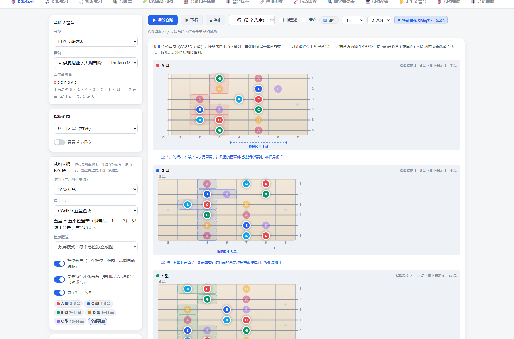

---

## 为什么做这个

练琴时最常撞上的三个问题，谱例书和练琴 App 都解决得不好：

1. **同一个音阶，换个把位就不认识了。** 这通常不是熟练度问题，而是「把位」这个几何概念没吃透 ——
   把位是**纵向**的：从某根弦的某一品出发、逐弦向上铺开的一整条音型，而不是「沿琴颈横向截一段」。
2. **知道音阶，但不知道它能落在什么和弦上。** 音阶与和声容易变成两张皮。
3. **和弦进行里相邻两个和弦之间手往哪走，没人讲。** 很多人一辈子只弹过五个 Barre 位置。

这个工具把三件事合成同一张指板：

```
选音阶 → 看它在 9 种指型系统下怎么分块 → 看它的特征和弦与琶音
      → 在具体和弦进行里算出「声部连接最优」的按法 → 给出该把位下能用的即兴素材
```

## 快速开始

不需要 Node、不需要构建、不需要联网、不需要装任何东西。

| 方式 | 步骤 |
|---|---|
| **本地打开**（推荐） | 下载 `index.html`，双击即可。断网也能用。 |
| **在线使用** | 打开 GitHub Pages 地址（见仓库右侧 About 里的链接）。 |
| **克隆** | `git clone <本仓库地址>` 后打开 `index.html`。 |

所有数据都内嵌在文件里，页面**不会发出任何网络请求**。你的偏好设置（调性、定弦、主题等）存在浏览器
`localStorage` 里，不上传。

## 十四个栏目

| 栏目 | 做什么 |
|---|---|
| 🎯 **指板探索** | 任选音阶 / 调 / 定弦，在指板上高亮。可切换 9 种指型系统、按把位分屏、叠加色块、高亮特征和弦琶音；带调式色彩档案与色彩光谱。每个指板图下方附 **TAB + 五线谱**，可播放、可循环跟练（详见下文两节） |
| 🎵 **指板练习** | 模块化的模进练习：选音阶 → 挑**具体的把位块**（可多选、可跨指型系统混选、可拖顺序）→ 每个块单独指定 **8 档走法**。逐块串行走句，指板图与谱面同步高亮。详见下一节 |
| 🎧 **视听练习** | 六种题型：指板认音、音阶填空、听音辨名、音程听辨、音阶听辨，以及**五线谱视奏** —— 题目画成带调号与节奏的五线谱，读谱后在指板上依次点出。谱表跟定弦自动走 |
| 📚 **音阶库** | 82 条音阶 / 琶音总表，按 9 大体系分组。每条给出音级结构、构成音、特征和弦与即兴候选、特点与用法 |
| 🧩 **CAGED 和弦** | 同一个和弦在指板上的五个位置。**按实际品位从低到高排列**，所以打头的是哪个型随主音变 |
| 🧮 **音阶和声速查** | 音阶的七级数 × 五层扩展和弦表，点任意一格跳到 CAGED 页看指型 |
| 🎼 **琶音探索** | 一个琶音在 CAGED 五个把位上的形状（实心＝本型、白心＝根音、空心圈＝相邻把位的同音），并给出常配的音阶 |
| 🔗 **连接训练** | 456 条和弦进行；挑一条进行，给出逐音声部连接与推荐按法 |
| 🎸 **玩点即兴** | 200 首伴奏带。先把和弦进行按小节铺开，再给出**声部连接最优**的和弦按法，最后列出每个和弦下推荐的即兴素材 |
| 🔍 **即兴查询表** | 给一个和弦性质与调性，列出能用的音阶、琶音与替代方案 |
| 🎹 **和弦配置** | 把整条进行当作一个整体，搜索「声部移动总量最小」的按法组合，给出几个不同的最优解 |
| 🖐 **2-1-2 琶音** | 跨弦音数按 `2-1-2` 交替的琶音指型一览（含只占 3 弦 5 音的基本型），起始弦可在第 6 / 5 / 4 / 3 弦之间切换 |
| 🎯 **和弦查询** | 反过来：在指板上点音（最少 3 个）**反推和弦**；**只点 2 个音时**给出这两颗音的音程关系，并判断是不是五和弦 `X5`。粗匹配 / 音级匹配 / 调内和弦三种口径；低音不是根音就写斜线和弦；对不上任何和弦时按「去掉根音拆成两个三音组」的五族体系兜底分类 |
| 🎼 **音阶查询** | 反过来：在指板上点音（最少 5 个）**反推音阶**。全库 82 条 × 12 个主音 = 984 条读法，按「你还差几个音」分层；同一组音的全部读法并排列出 —— 所以七声音阶也只能给出「母音阶组」 |

## 看谱在指板上找音：五线谱视奏

视听练习里的**第 6 个题型**。题目不是文字，而是一段**真实的五线谱**：带**调号**、带**节奏** ——
时值、符干、符尾、附点、休止符、终止小节线都按记谱规矩画。读谱之后，在指板上**按顺序**点出对应的音。

| 视奏 · 吉他（高音谱表） | 视奏 · 贝斯 4 弦（低音谱表） |
|---|---|
| 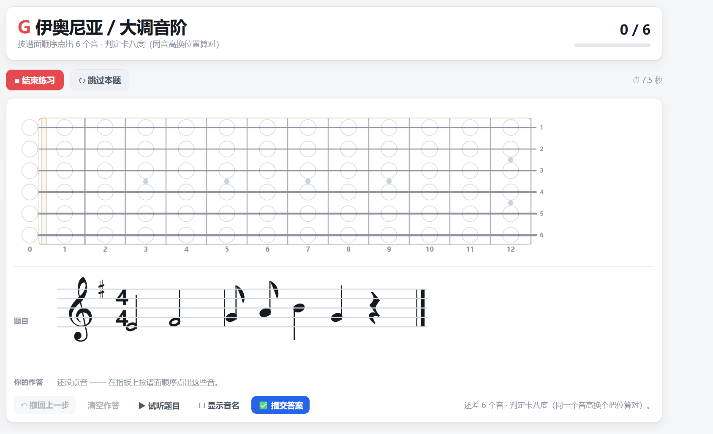 | 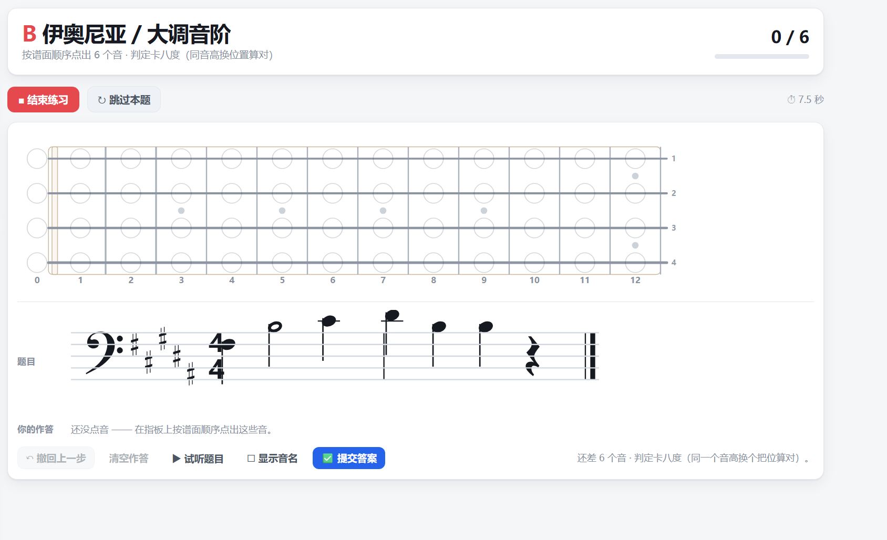 |

- **谱表跟定弦自动走**：吉他（含各种开放定弦）→ **高音谱表**；贝斯 4 弦 EADG / 5 弦 BEADG → **低音谱表**（F 谱号）。
  不新增开关，也不用自己切 —— 同一族内换定弦保留当前题，**跨族换定弦自动换一题**。
- **记谱按各自惯例**：吉他高八度记谱，贝斯也按贝斯谱惯例高八度记谱
  （low E 发声 E1，谱上写在低音谱表下加一线，与吉他的写法平行一致）。
  谱下「显示音名」标的是**谱面音名**。
- **题目一定点得出来**：只在「当前可点范围里属于本题音阶的音」中走句。贝斯题的音域窗收在
  **加线不超过 3 条**那一段（约实际发声 A0–G3）—— 按 24 品直走会拖出七八条加线，那样的谱没法读。
- **点一下，同音高的位置全部亮起**（环色是该音高类的专用色，与「和弦查询」同一套 12 色），
  顺便看清这个音在琴颈上的所有落点。
- **判定卡八度**：谱面写的是哪个音高就点出那个音高 —— 同一个音高**换个把位算对**
  （1 弦空弦和 2 弦 5 品都是 E4），**点成别的八度算错**。全对自动进下一题并加分；
  有错则谱面上那几颗标红叉、扣 6 分、停在本题，撤回改对再提交即可。
- **读谱辅助**：**▶ 试听题目**按谱面音高依次放一遍（休止符只占时间不出声）；
  **☐ 显示音名**把每个音的音名标在谱下。
- 作答行实时记录你点过的音（带序号），支持 **↶ 撤回上一步** 与**清空作答**，点满后按 **✅ 提交答案**。
- **每题音符数自己定**（3–12，默认 5），按 8 组母音阶分组出题；题型选择、音符数与音名开关都存进本机偏好。

## 指板练习：把练习拆成「音阶 × 指型系统 × 把位 × 走法」

同一个音阶换个把位就不认识了 —— 那通常不是熟练度问题，而是没在**单个把位**里把它练透。
「指板练习」只做一件事：**一次只练你点的那几个位置**。

| 定制练习位置（多选 / 跨指型系统混选 / 可拖顺序） | 逐块走句 + 八档走法 + 谱面 |
|---|---|
| 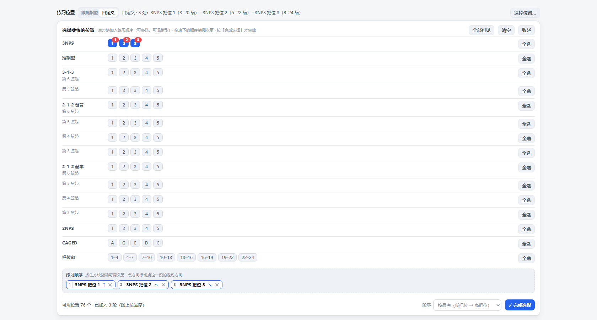 | 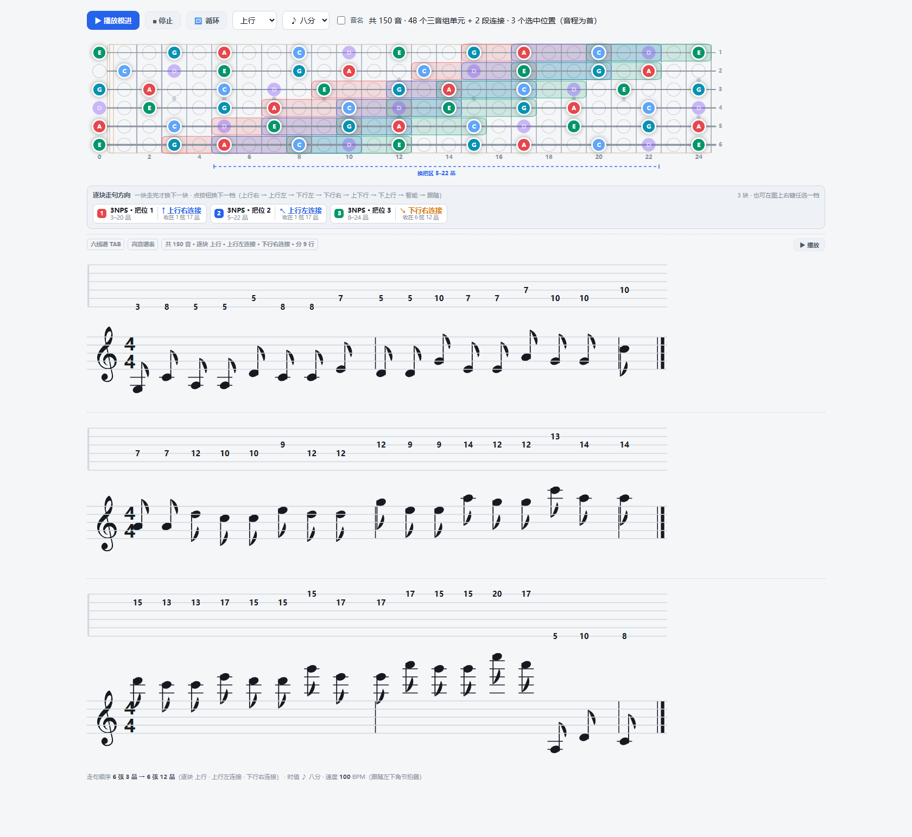 |

- **按定弦自动切两套组织逻辑**：吉他 6 / 7 弦的纯四度、标准调弦、全降半音 / 全降全音这几族，
  模进编排**以音程关系为主、位置关系为辅**；其他开放调弦（DADGAD / Open G / Open D /
  FACGCE / DAEAC#E / CGDGBD…）则**按把位逻辑**优化 —— 同一套算法，两种排法。
- **位置是一块一块选的**：一块 = 通用把位分支的一个把位 / CAGED 的一个型 / 三品窗的一段。
  五声族有 **76** 处可选，六 / 七 / 八声族各 **102** 处。选中的进一个可拖动的**练习顺序槽**；
  段序两档可切（默认按品序，也可按你点选的次序）。**换把区在指板图上自动标注**。
- **练习级别 L0–L4**：逐音 / 二音组 / 三音组 / 四音组 / 套嵌，外加模进布局与音序 σ。
  三音组是枚举能力最强的一档 —— 长度 ≤ 4 个音的走句里它能给出 **8** 种音序，四音组只有 6 种。
- **逐块串行**：一个把位块整条走完才换下一块。指板图下方**每个块都有一个按钮**，点一下换下一档；
  也可以在**指板图上右键**那一块，八档菜单任选，还能「全部同此」。

### 八档走法：四档「连接」是给换把用的

走句方向从 3 档扩到 8 档。四档「连接」的差别只看**最后一个音落在哪**：

| 档 | 走到哪、怎么收 | 末音落在 |
|---|---|---|
| ↑ 上行右连接 | 走到最高音弦的最高音就收住（＝原来的「上行」） | 右上角 |
| ↖ 上行左连接 | 升到顶后**在最高音弦上折回** | **最高音弦的最低音** —— 接左边（低把位）那一块 |
| ↓ 下行左连接 | 走到最低音弦的最低音就收住（＝原来的「下行」） | 左下角 |
| ↘ 下行右连接 | 到底后**在最低音弦上折回** | **最低音弦的最高音** —— 接右边（高把位）那一块 |
| ↕ 上下行 / ⇵ 下上行 | 上行原路折回 / 上下行的镜像（先倒着走到最低音再回到最高音） | 顶点 |
| ⇅ 智能决定 / ↝ 跟随工具条 | 按下一块的位置自动选，或跟随工具条那一档 | —— |

按钮副标上「**收在 X 弦 Y 品**」写的就是这一块走句**真正的末音** —— 一眼看出它接的是哪一块。

> **为什么「几音一组」不够用**：模进那一层只认「一条线 + 整段变换」，而
> 「末音必须落在某根弦的某个品」是**坐标相关**的条件 —— 音序决定末音（末音未必落在窗口最后一格），
> 套嵌档还会把单元整体重排。所以收尾做成**模进整段走完、再追加一段独立的连接尾**，
> 模进滑窗那一层一行未改。全枚举 **13,032 次「块 × 档」**走句实测：连接档的末音
> **100%** 落在对应的物理极值弦上，且不引入任何新的大跳。

## 每个指板图都带 TAB 与五线谱，可以循环跟练

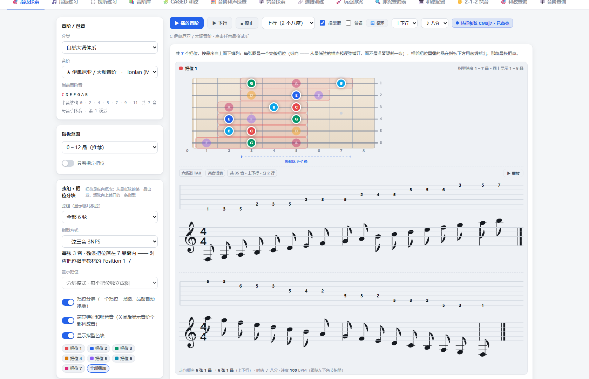

- **TAB 类型跟「乐器 + 定弦」走**：六线 / 七线 TAB 给吉他，四线 / 五线 TAB 给贝斯；
  五线谱的谱表也自动分派 —— 吉他走高音谱表，贝斯走低音谱表（F 谱号）。
  **19 条定弦逐一核查通过**：TAB 横线数 = 弦数，谱面音符数与走句音数一致。
- **长走句自动分页**：每行最多 **18 个音**，并且**均分**（各行最多差 1 个音）。
  分页界限与版面 / 乐器 / 定弦都无关 —— 一块再长也不会被压扁到看不清。
- **播放与跟练**：**▶ 播放**按谱面音高依次放一遍，**时值与左下角 BPM 保持一致**；
  **🔁 循环**播到最后自动从头再来。
- **播到哪一颗就只亮哪一颗**：指板图上只点亮谱面当前那一音**在走句里记着的那一个位置**
  （弦 + 品唯一确定一个音位），TAB 与五线谱同步高亮 —— 不再把同音高的位置全部点亮，
  跟谱时看得出手该按哪根弦哪个品。

## 数据规模

| 项 | 数量 |
|---|---|
| 音阶 / 琶音条目 | **82** 条，分 **9** 大体系（自然大调 / 和声小调 / 旋律小调 / 和声大调 / 双和声小调 / 五声·布鲁斯 / 对称音阶 / 异域·Bebop / 琶音·和弦） |
| 调式色彩档案 | **59** 条 |
| 指型系统 | **10** 种（3NPS / 4NPS / 宽指型 / 3-1-3 / 2-1-2 / 2-1-2 基本型 / 2NPS / CAGED 五型 / 把位窗 / 不分区）。下拉里同时可见 **9** 种 —— **「五声 / 布鲁斯」族 12 条**（大调 / 小调 / 属五声 + 埃及、三个日本五声、五声调式 3・4 型 + 布鲁斯 / 大调布鲁斯 / 小调六声）把 4NPS 换成「宽指型（本把位 7 品窗全取）」 |
| 定弦 | **19** 种（6 弦吉他 11、7 弦吉他 6、4 弦贝斯 1、5 弦贝斯 1），含 Drop D、降半音、降全音、DADGAD、Open G、Open D、全四度、7 弦 Drop A / C# 等 |
| 和弦性质 | **23** 种（三和弦 / 六和弦 / 七和弦 / 九和弦 / 挂留 / 变化属 …） |
| 和弦进行 | **456** 条，按「偏离度峰值档」0–6 分类 |
| 伴奏带 | **200** 首，带风格筛选 |
| 弦组 | **16** 组（从「全部 6 弦」到任意相邻 2 弦） |
| 指板练习 · 可选位置 | **76** 处（五声 / 布鲁斯族）/ **102** 处（六 / 七 / 八声族），按 8 个指型系统分行；只列与当前品段相交的位置 |
| 指板练习 · 走句方向 | **8** 档（上行右 / 上行左 / 下行左 / 下行右 / 上下行 / 下上行 / 智能决定 / 跟随工具条） |
| 指型谱 · 分页 | 每行最多 **18** 个音，均分（各行最多差 1 个音）—— 唯一界限，与版面 / 乐器 / 定弦无关 |
| 听辨体系 | **8** 组母音阶，共 58 条非琶音音阶入题库 |
| 点音反查 · 和弦性质 | **46** 条（比「即兴查询表」的 23 条宽一档：补齐六和弦、九 / 十一 / 十三、变化属，以及各种缺音形态） |
| 点音反查 · 音阶读法 | **984** 条（82 条音阶 × 12 个主音；音高类塌陷的读法不算） |

> 以上数字全部由页面数据在运行时统计得出，不是手写的宣传数。

## 技术说明

- **单文件**：整个应用（HTML + CSS + JS）就是 `index.html` 一个文件，**14,966 行 / 992 KB**。无构建步骤、无依赖、无 CDN。
- **零外部请求**：没有 `<link>`、没有 `fetch`、没有 `XMLHttpRequest`、没有动态 `import()`。唯一出现的 URL 是 SVG 的命名空间标识符，不产生网络访问。
- **声音是实时合成的**：用 Web Audio 的三角波 + 锯齿波叠加振荡器合成音高，仓库里**不含任何音频文件**。
- **数据全部内嵌**：音阶、定弦、和弦进行、伴奏带、素材表都是 JS 字面量，没有后端。
- **渲染**：指板图是用 JS 现算的 SVG，不是位图，所以任意缩放下都清晰、可打印。
- **主题**：浅色 / 暗色两套，靠 CSS 变量切换。
- **状态持久化**：偏好设置写 `localStorage`，只在本机。

## 截图

| 指板探索 | 音阶库 |
|---|---|
|  | 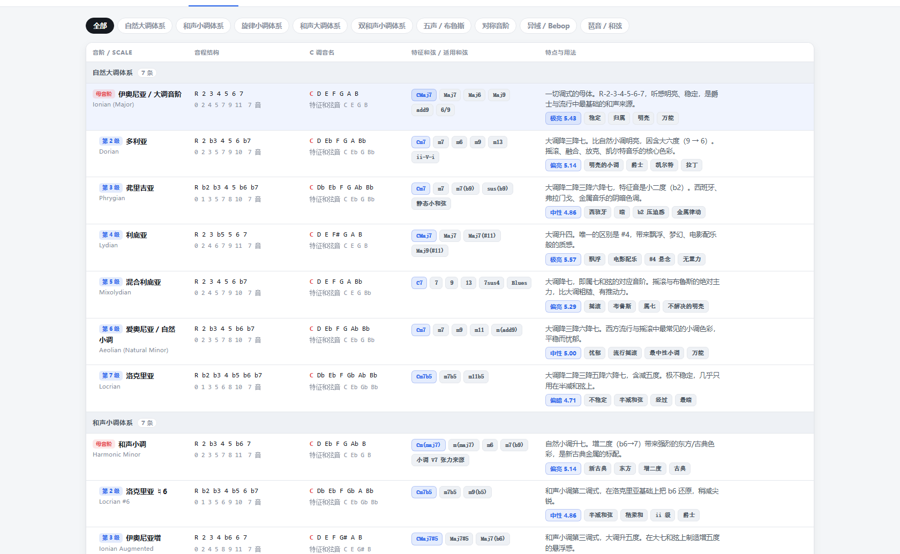 |

| CAGED 和弦 | 琶音探索 |
|---|---|
| 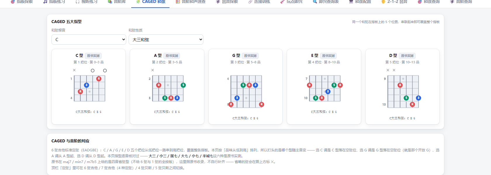 | 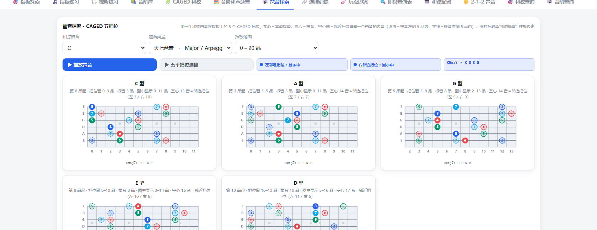 |

| 连接训练 · 进行库 | 玩点即兴 · 声部连接最优按法 |
|---|---|
| 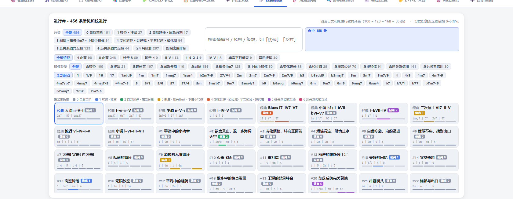 | 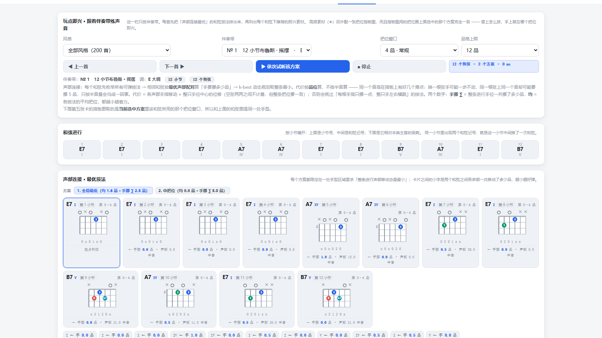 |

**玩点即兴 · 每个和弦下的即兴素材 + 高频素材把位指板图**（两者取同一个把位窗口）：

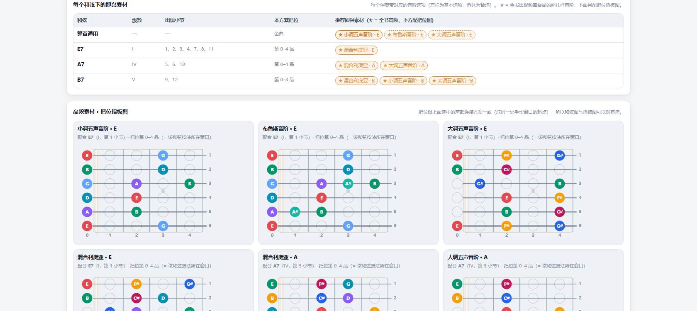

## 已知边界

- 面向 **6 弦吉他 / 7 弦吉他 / 4 弦贝斯 / 5 弦贝斯**，其他弦数或非十二平均律乐器不在范围内。
- 声部连接用的是**品位几何**近似，不模拟生理层面的指法限制（比如同一根手指能否同时够到两处）。
- 「推荐即兴素材」是按和弦性质与调式匹配得出的，属于**可用的集合**，不是「唯一正确答案」；
  实际即兴里更取决于你想听什么。
- 部分伴奏带在原素材里只给了整首的音阶选项、没有逐和弦选项；这种情况素材表会回退到整首通用项，
  并用虚线徽章标出，不假装它有专属选项。
- 「指板练习」在**跟随指型**模式下会沿一条回退链选指型：3NPS → CAGED → 宽指型 → 4NPS。
  少数定弦 × 音阶组合铺不出某一种指型的块（例如 7 弦 C# 定弦上的 3NPS），
  这时会自动换到下一个能铺出来的指型，并把**实际用的是哪一种**写在页头提示里，不静默替换。
  自己点选位置（自定义模式）时不走这条回退链 —— 你点的是具体的块，缺了就如实说缺。

## 许可

[MIT](LICENSE) —— 自由使用、修改、再分发，保留版权声明即可。

---

<sub>用简体中文编写。纯前端、零依赖，欢迎提 Issue 说说哪里不好用。</sub>
